封闭园区自动驾驶搭建--感知设备集成
===================

## 概述

 - 该部分内容，旨在说明与感知相关的传感器设备集成方法，为之后的感知、预测、规划等模块的运行打下基础。在进行该部分内容操作之前，要求用户完成了循迹设备的安装配置，并能正常实现循迹功能。
## 摄像头安装配置与数据验证
 - 摄像头型号：LI-USB30-AR023ZWDR（leopard 摄像头）。
 - 摄像头LI-USB30-AR023ZWDR采用标准USB 3.0接口，由Leopard Imaging Inc.制造。该系列产品基于AZ023Z 1080P传感器和安森美半导体的AP0202 ISP。它支持外部触发和软件触发。
 - 建议使用两个带 6mm镜头的摄像头和一个带 25mm镜头的摄像头，以达到所需的性能。
 - 更多详细参数可参考：[leopard数据手册](https://leopardimaging.com/product/li-usb30-ar023zwdrb/)。

### 摄像头的安装固定
 - 牢固安装在小车结构架前端横梁处，水平安装，俯仰角向下0-2度（向下倾斜小于2度，不能上仰），翻滚角误差±1度（左右两侧的平齐程度），航向角误差±2度，镜头保持清洁，避免影响图像采集。安装位置如下图所示：
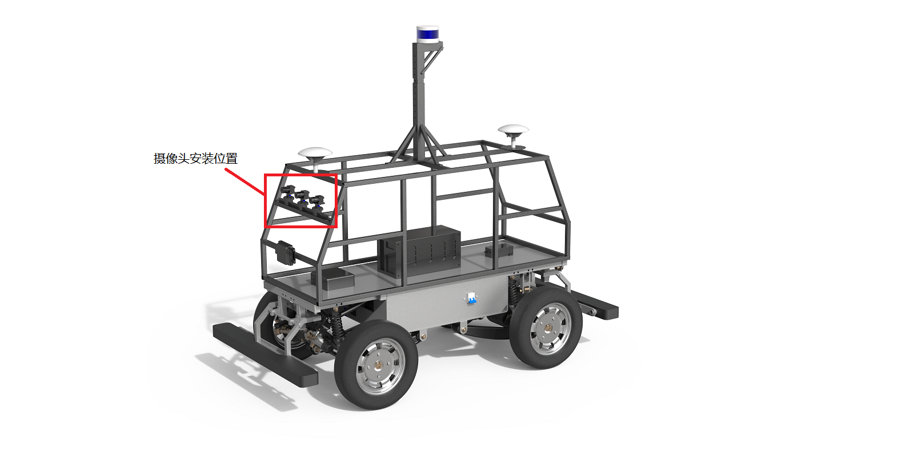
 - 注意摄像头不要装反(usb接口应该在下方)，正确的放置方向如下图所示：
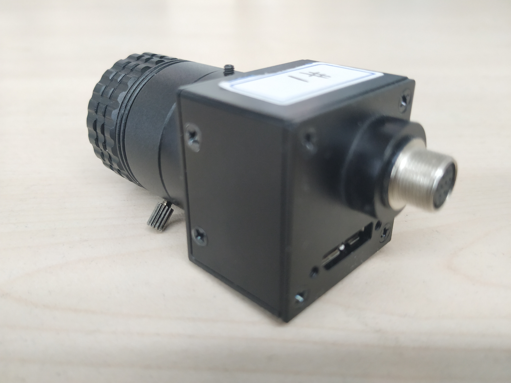
### 摄像头与工控机连接
 - 直接用数据线将设备连接在IPC的USB3.0接口。两个6mm摄像头分别插在工控机USB扩展板的第一个、第二个USB接口上，25mm摄像头接在扩展板的第三个接口上（用户可以更改摄像头连接位置，只需与后文中提到的rules文件对应即可），USB扩展板的端口号顺序及数据线与摄像头的连接方式如下图所示：
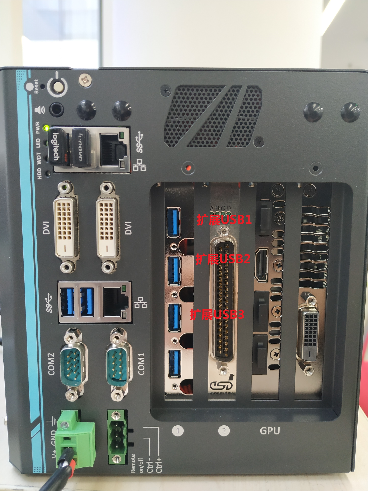
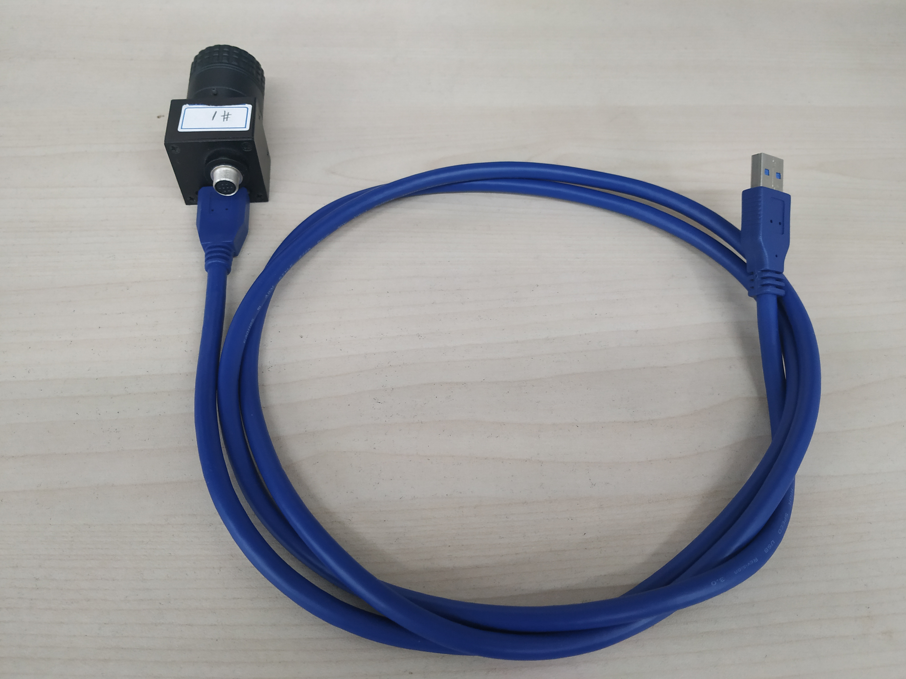
### 摄像头规则文件的配置
 摄像头规则文件的作用是，当linux启动时，根据规则文件设置的规则，自动生成对应的软链接文件。
 
 - 在docker环境外，执行如下命令，打开默认的规则文件
```
vim  ～/apollp/docker/setup_host/etc/udev/rules.d/99-webcam.rules      //  ~/apollo/为apollo工程的根目录，用户根据自身情况修改，后文不再赘述。
```
 - 根据自身情况，修改rules文件，一个摄像头的rules文件示例如下所示：

```
SUBSYSTEM=="video4linux", SUBSYSTEMS=="usb", KERNELS=="8-2:1.0", MODE="0666", SYMLINK+="camera/trafficlights", OWNER="apollo", GROUP="apollo"
SUBSYSTEM=="video4linux", SUBSYSTEMS=="usb", KERNELS=="6-2:1.0", MODE="0666", SYMLINK+="camera/obstacle", OWNER="apollo", GROUP="apollo"
SUBSYSTEM=="video4linux", SUBSYSTEMS=="usb", KERNELS=="4-2:1.0", MODE="0666", SYMLINK+="camera/lanemark", OWNER="apollo", GROUP="apollo"
```
其中，第一条代表连接到USB端口号为`8-2:1.0`(扩展USB3)的摄像头对应的软链接文件为`camera/trafficlights`；第二条代表连接到USB端口号为`6-2:1.0`(扩展USB2)的摄像头对应的软链接文件为`camera/obstacle`；第三条代表连接到USB端口号为`4-2:1.0`(扩展USB1)的摄像头对应的软链接文件为`camera/lanemark`，用户可根据自身实际情况修改。

 - 在docker环境外，执行如下命令，使配置的规则文件在本地系统生效:
 
 ```
  bash ~/apollo/docker/setup_host/setup_host.sh  
  sudo reboot  
 ```
 

### 摄像头的启动
 - 在摄像头与工控机正常连接的基础上，执行`ls /dev/video*`指令，查看摄像头是否被识别，
 如果摄像头设备已经被识别，则会显示以`video`开头的设备名称，否则的话，请检查摄像头与工控机的连线是否可靠。
 - 检查`/dev/camera`目录是否存在，以及该目录下`obstacle`、`trafficlights`、`lanemark`三个软链接文件是否存在(根据规则文件配置不同，可能有1个或多个软链接文件)。如果使用`ls /dev/video*`命令能显示摄像头设备，但不存在软链接文件或者没有`camera`文件夹，请参照上文`摄像头规则文件的配置`章节，检查规则文件是否配置正确。
 - 启动docker环境。
 - 在docker环境下编译usbcam
 `bash /apollo/apollo.sh build_usbcam`
 - 启动dreamview
 `bash /apollo/scripts/bootstrap.sh`
 - 在`Tasks`标签栏下依次打开`SimControl`和`Camera Sensor`开关，`Camera Sensor`打开后，务必关闭`SimControl`。选择`Standard`模式，如下图所示：
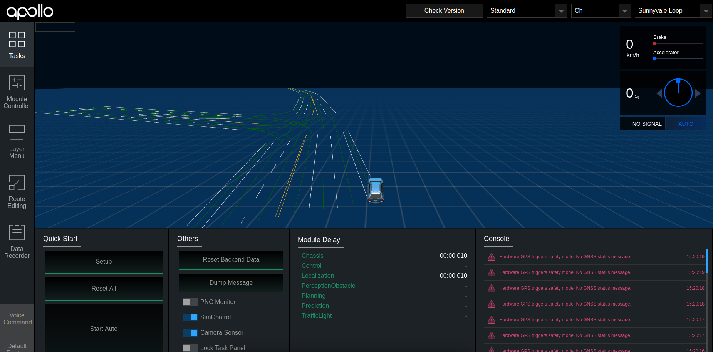
 - 在`Module Controller`标签栏下，打开`Camera`开关，如下图所示：
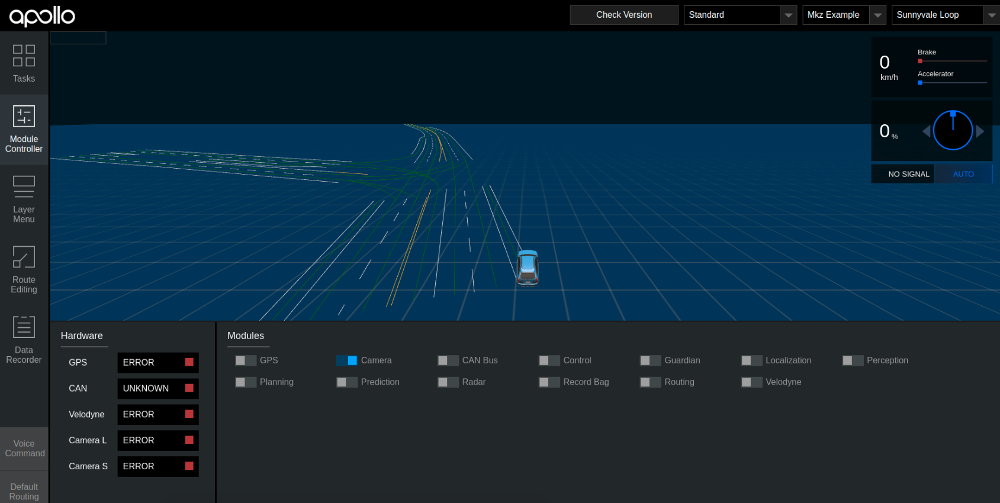
 - 如果一切正常，则会在`dreamview`左上角出现摄像头采集的图像，如下图所示：
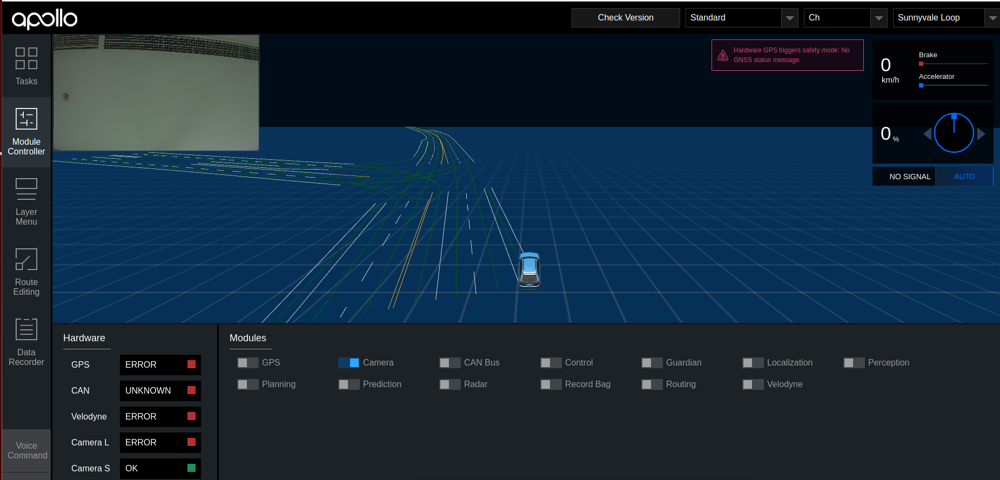
 - 在正确完成上述步骤后，在`docker`环境内分别执行如下命令，查看是否有数据。
```
rostopic echo /apollo/sensor/camera/traffic/image_long
rostopic echo /apollo/sensor/camera/traffic/image_short
```
## 毫米波雷达安装配置与数据验证

 - 毫米波雷达型号：continental AS 408-21
 - continental AS 408-21简介：ARS408-21 是大陆 40X 毫米波雷达传感器系列中最新推出的高端产品，可以适用于不同的应用场景。ARS 408-21 很好的处理了测量性能与高安全性之间的矛盾，可实时检测目标的距离并根据当前车速判断是否存在碰撞风险可靠；具有自动故障检测功能，可识别传感器问题，并自动输出故障码鲁棒、轻量化设计；通过使用相对简单的雷达测量技术，以及在汽车行业的深度研发和批量生产基础，可以保证产品鲁棒和轻量化性能。

### 毫米波雷达接口及线序
 - continental AS 408-21传感器采用12V直流供电，使用CAN通信接口。使用时，通过如下图所示的连接线缆将传感器CAN通信接口与Apollo的CAN1口连接，电源接口接入12V直流电源(车辆上提供12V电源接线盒)，注意正负极。
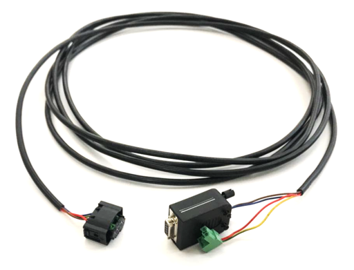
 - 传感器接口及定义如下图所示：其中，端口1接12V直流电源；端口8接GND；端口4接CAN_L；端口7接CAN_H。

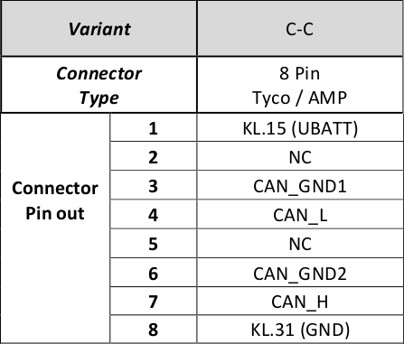

 - 毫米波雷达CAN接口与车上的CAN1接口链接，如下图所示：
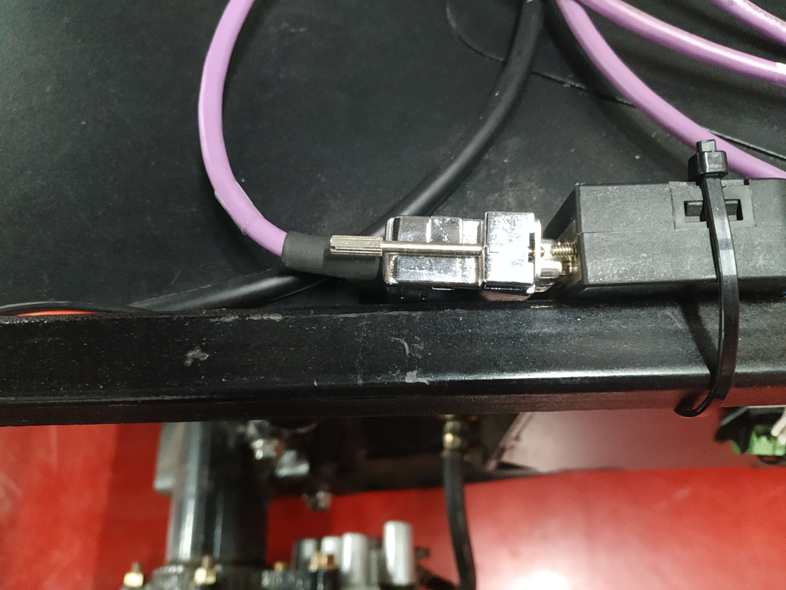

### 毫米波雷达的安装固定
 - 传感器应安装在车前方中心处，当人正向面对车辆正前方时，传感器的正面朝向人，传感器的连接口朝向人的右手边，如下图所示：
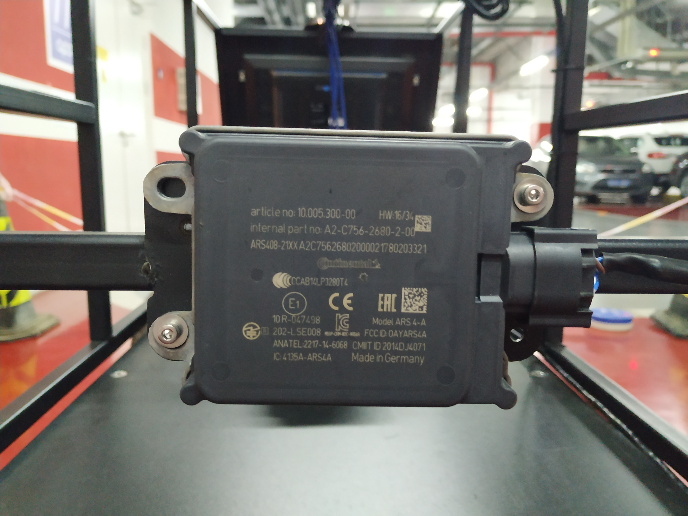
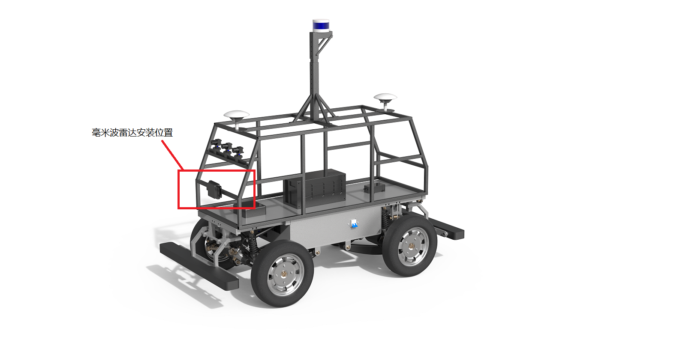
 - 毫米波雷达要牢靠固定在车身上，连接到毫米波雷达的接头要牢靠接插。离地面高0.5米，不能向下倾斜，向上仰0-2度以内，高度误差±0.2米，俯仰角误差0-2度（向上仰小于2度，不能向下倾斜），翻滚角误差±2度（radar左右两侧的平齐程度），航向角误差±2度（radar是否正对前方）。
### 毫米波雷达的配置及启动
 - 传感器参数的配置：该传感器配置文件位于`/apollo/modules/drivers/radar/conti_radar/conf/`目录下的`conti_radar.conf`和`conti_radar_conf.pb.txt`文件中，可根据实际情况进行配置。
 - 正确启动Apollo及DreamView，选择车辆型号及运行模式，并打开`Radar`模块开关，如下图所示：
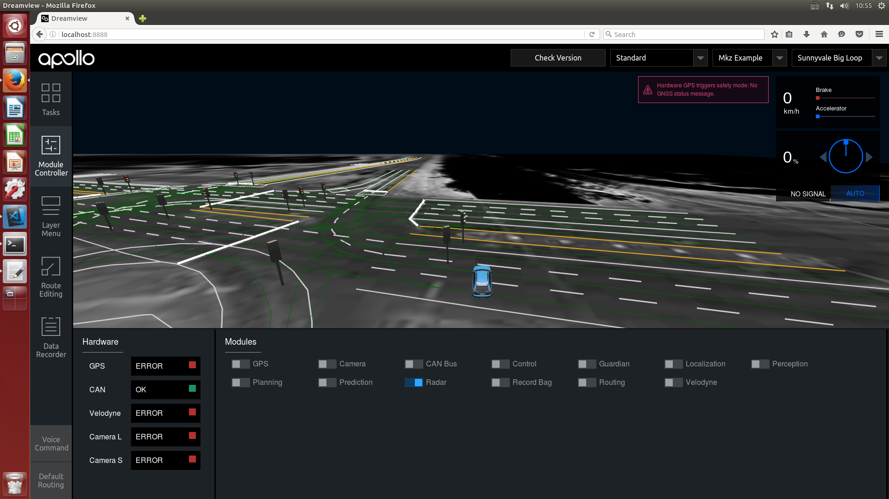
 - 输入`rostopic list`命令，应显示`/apollo/senson/conti_radar`话题，如下图所示：
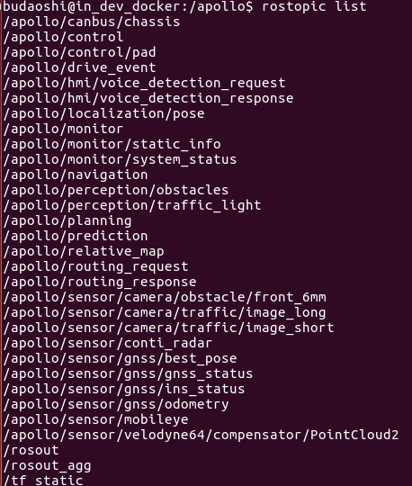
 - 输入`rostopic echo /apollo/sensor/conti_radar` 命令，打印该话题，如下图所示：
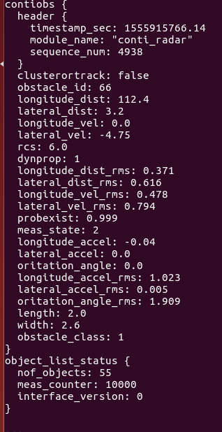
 - 主要参数的含义如下表所示：
 
 
	|参数 | 含义 | 
	|---|---|
	|`longitude_dist`   | 距目标的纵向距离 | 
	| `lateral_dist`   | 距目标的横向距离 | 
	|`longitude_vel`   | 目标的纵向速度   | 
	| `lateral_vel`   |  目标的横向速度  | 
	
	
### 毫米波雷达数据的验证
 - 纵向距离(`longitude_dist`)/横向距离(`lateral_dist`)的验证：该传感器默认使用`长距离`模式，检测距离为0.2~250m，在车辆正前方检测距离范围内，分别放置障碍物，查看`/apollo/sensor/conti_radar`话题中的`longitute_dist`、`lateral_dist`数据是否正常(单位m)。下图中红色部分为长距离模式下传感器检测范围，误差在+/-0.4m内为正常。

 - 纵向速度(`longitude_vel`)/横向速度(`lateral_vel`)的验证：使得目标物体以固定速度在检测范围内运动，检测数据是否在误差允许有范围内。
 - 该传感器各项参数的测量范围及分辨率如下图所示：
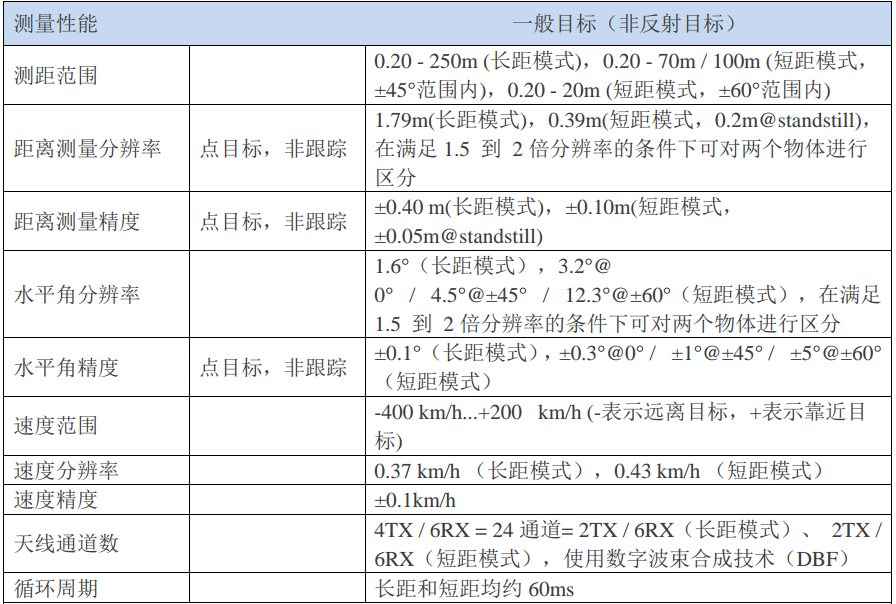

## 激光雷达安装与数据验证
 - 激光雷达型号：80-VLP-16（velodyne 16线激光雷达）
 - 更多详细参数可参考：[https://velodynelidar.com/vlp-16.html](https://velodynelidar.com/vlp-16.html)

### 激光雷达的安装固定
 - 16线激光雷达及接口盒要牢靠固定在车身上，连接到接口盒上的接头要牢靠接插。水平安装在车顶部，对地高度1.5米，水平放置，精度在2度以内。连接线缆带屏蔽，接口镀金， 网线两头需贴上标签注明设备名称。安装位置如下图：
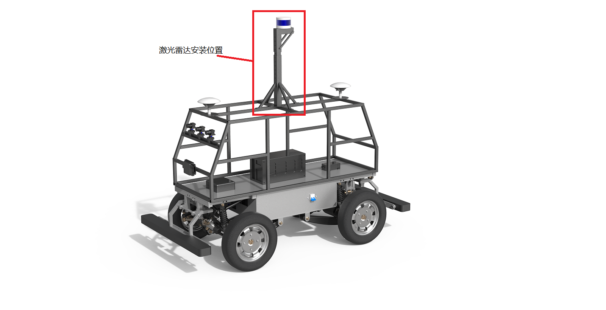
 - 安装激光雷达时线缆方向朝向车辆的后方。

### 激光雷达与车辆的接线
 - 配套的激光雷达线束为1拖3线缆。其中一端有三个接口，分别为数据口(网线接口)、12V电源接口、GPS授时接口，如下图所示：
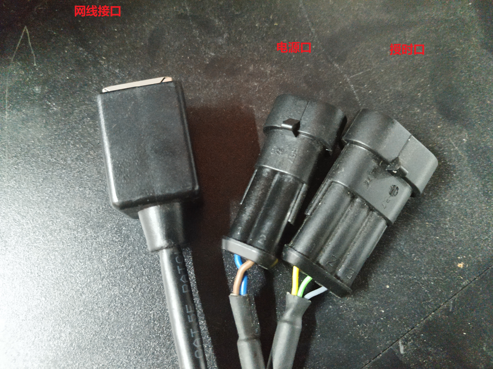
 - 数据口：通过以太网线缆与IPC连接。
 - 12V电源接口：与12V电源接口连接，接口具备防反插功能。
 - GPS授时接口：与GPS的授时接口连接，接口具备防反插功能。
 - 线缆的另一端为航插接头，与激光雷达连接，如下图所示：
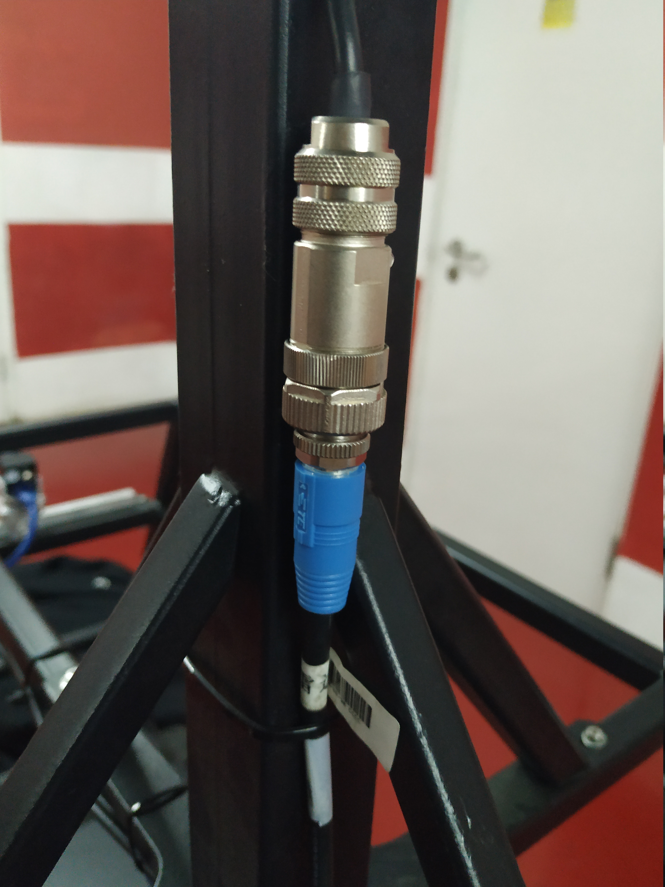
### 激光雷达的配置及启动
 - 激光雷达的相关参数配置：雷达出厂默认ip地址为192.168.1.201，在浏览器中输入激光雷达ip地址，打开配置界面，将激光雷达的ip地址修改为与IPC的ip地址处于相同号段， 将`NetWork(Sensor)`选项卡下的`Data Port`修改为2369，将`Telemetry Port`修改为8309，点击`set` 按键、`Save Configuration`按键使配置生效。
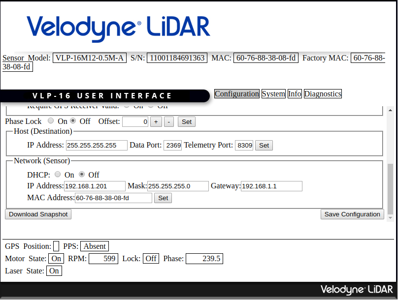
### 激光雷达数据的验证
 在完成上述配置后，可以使用以下方法验证激光雷达能否正常工作：
 
 - 查看雷达是否接收到GPS设备的PPS信号：在浏览器中输入雷达ip地址，打开配置界面，如果`GPS`选项卡中的`Position`有数据且`PPS`显示为`Locked`，则代表雷达收到了PPS信号。
 - 查看是否能ping通激光雷达：在正确进行配置后，可以使用`ping`指令，查看是否能与激光雷达通信，正确结果如下图所示，如果不能ping通，请检查激光雷达及IPC的ip地址设置。

 - 使用VeloView查看点云数据：使用Velodyne官网提供的VeloView软件，在线查看点云数据，点击软件的`Sensor Stream`按钮，选择传感器型号为`VLP-16`，`LIDAR Port`为2369，`GPS Port`为8309，如果一切正常，则可以显示点云信息，如下图所示：  
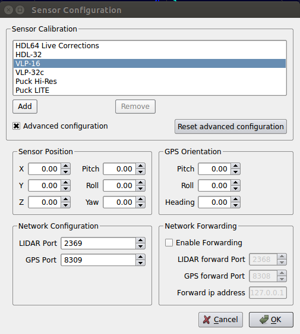

 - 在Apollo启动后，在`docker`环境内，启动`dreamview`后，执行`bash /apollo/scripts/velodyne_16.sh`命令后，可以正常打印`/apollo/sensor/velodyne16/PointCloud2`、`/apollo/sensor/velodyne16/VelodyneScanUnified`这两个`topic`并且能正常输出数据，则代表激光雷达配置成功。