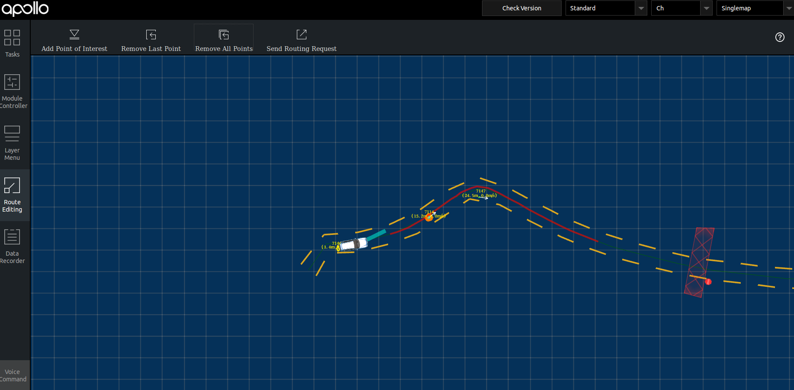
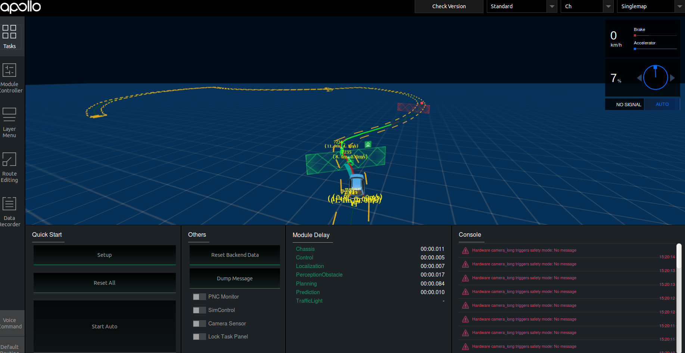
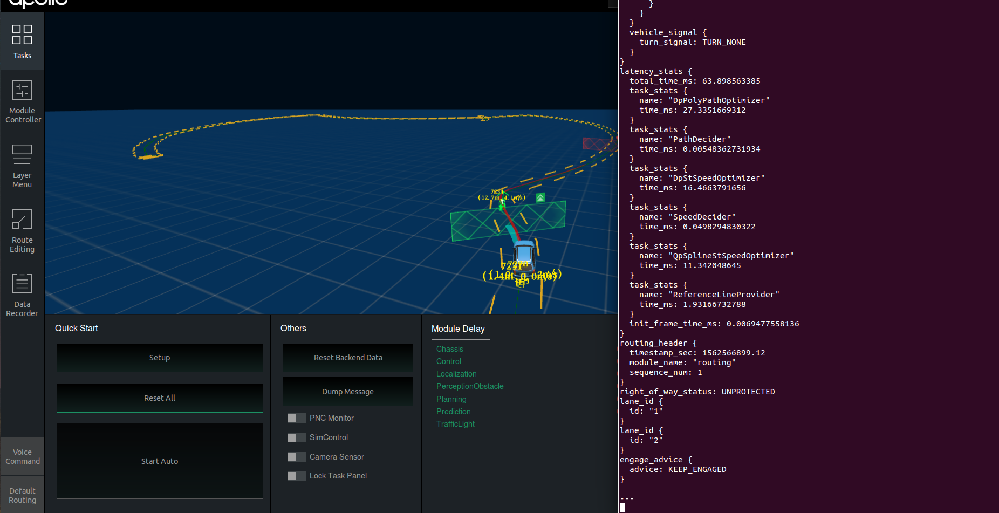

# 封闭园区自动驾驶搭建--规划适配
## 前提条件

 1. 正确配置了gnss、imu，GPS、Localization模块能正常启动。
 2. 确保传感器内参外参文件的正确配置。
 3. 存在高精地图并正确完成了感知适配与开环测试。

## 配置文件的修改
|修改文件名称 | 修改内容 | 对应的gflag参数 | 作用 | 
|---|---|---|---|
|`planning.conf` | 修改`default_cruise_speed`数值| 比如1.5 | 默认巡航速度|
|`planning.conf` | 修改`planning_upper_speed_limit`数值| 比如1.5 |车planning最大速度 |
|`planning.conf` | 修改`planning_lower_speed_limit`数值| 比如0.5 |车planning最小速度 |
|`planning.conf` |添加`max_collision_distance`数值| 比如0.0 | 车默认为碰撞距离|
|`planning.conf` |添加`max_stop_distance_obstaclee`数值| 比如1 | 障碍物最大停止距离|
|`planning.conf` |修改`min_stop_distance_obstacl`数值| 比如1 | 障碍物最小停止距离|
|`planning.conf` |添加`static_decision_nudge_l_buffer`数值| 比如0.1 | 车从障碍物旁边经过时与障碍物的距离|
|`planning.conf` |添加`nudge_distance_obstacle`数值| 比如0.3 | 障碍物旁边的方圆安全距离|
|`planning_config.pb.txt` |修改`total_time`数值| 比如15.0 | planning规划多长时间的路线|
|`planning_config.pb.txt` |修改`max_acceleration`数值| 比如1.0 | 车辆最大加速度|
|`planning_config.pb.txt` |修改`lowest_speed`数值| 比如0.5 | planning时车的最低速度|
|`planning_config.pb.txt` |修改`preferred_max_acceleration`数值| 比如1.0 | 车最合适的最大加速度|
|`planning_config.pb.txt` |修改`max_accel`数值| 比如1.0 | 车最大加速度|
|`planning_config.pb.txt` |修改`preferred_accele`数值| 比如1.0 | 车最合适的加速度|

注意：这些配置重新启动planning模块即可生效。为了安全起见，车planning速度一定要设置得比较小，建议按照上面的给出的值来设置相应的配置参数。
## 规划启动流程及开环测试
把车辆开到户外，手动控制车辆，在感知有障碍物信息显示的情况下添加routing点并查看是否有planning轨迹线信息。
1. 进入docker环境，用gpu编译项目，编译项目，启动Dreamview 

```
    cd apollo
    bash docker/scripts/dev_start.sh
    bash docker/scripts/dev_into.sh
    bash apollo.sh build_gpu
    bash scripts/bootstrap.sh
```

2. 选择车辆相应配置（ch），选择相应高精地图，在module Controller标签页启动gps、localization、Radar、canbus、control模块
3. 用以下命令启动激光雷达

```
    bash scripts/velodyne_16.sh
```

4. 用以下命令查看topic

```
    rostopic echo /apollo/localization/pose 
    #如果有正常输出就查看下一条topic
    rostopic echo /apollo/tf_static #确保里面child_frame_id是velodyne16
    rostopic echo /apollo/sensor/velodyne16/compensator/PointCloud2 #确保有点云输出
```

5. 在module Controller标签页启动perception模块，并在dreamview上查看障碍物信息，并确定有障碍物输出，如下图所示

6. 在module Controller标签页启动planning、prediction、routing模块确保这些模块能够正常启动。
7. 在routing editor标签中点击Add Point of Interest按钮添加一个point 然后选择Send Routing Request按钮发送添加的routing点，从dreamview中查看会出现一个蓝色的线 以及一个红色的stop标志。
如下图所示

8. 在车前方存在人或者自行车（车上有人）时，在task标签页查看planning轨迹线，如下图所示



并用以下命令查看planning topic信息

```
    rostopic echo /apollo/planning
```

如下图所示

  
如果出现上图所示轨迹线和topic信息，表示规划模块适配和开环测试通过，否则继续查看log信息进行调试。